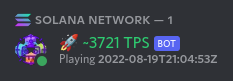

# Solana TPS BOT

[](https://github.com/ellerbrock/open-source-badges/)
[](https://github.com/DerZwergGimli/SolanaStatus_BOT/actions/workflows/docker-publish.yml)

[](https://opensource.org/licenses/MIT)


This repo contains a **Discord** bot that is **monitoring** the **SolanaBlockchain**.


## Features:

- Display current TPS (transactions per second)
- Command `!tps` will print out the TPS
- Connection to RPC

## View




## Discord-Settings:

- ### BOT Permissions
    - Manage Role
    - Change Nickname
- ### BOT Roles
    - tickers-red
    - tickers-green

Create 2 roles in you discord server so the bot will change its nickname color based on that.


## Deploy via Docker

- Copy `.env.sample` to `.env`
- Add your access tokens and config to `.env`
- Start you BOT with `docker-compose up -d`

### ENV

- Required:

```gitignore
RUST_LOG=error
DISCORD_TOKEN=<DISCORD_TOKEN>
RPC_ENDPOINT=<RPC_ENDPOINT>
LOOP_UPDATE_SLEEP=60
TPS_THRESHOLD=2000
```

## Donations:

- Solana-Wallet: `coffeeplease.sol`
- ETH-Address: `0xB0Be2420cA00C86aD983F246DEF49EA0F9779DCd`
