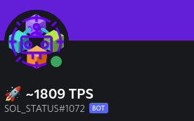
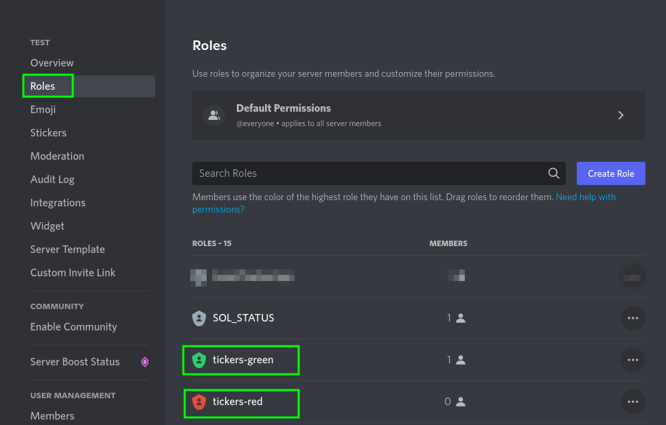

# Solana TPS BOT

[](https://github.com/ellerbrock/open-source-badges/)
[](https://github.com/DerZwergGimli/SolanaStatus_BOT/actions/workflows/rust.yml)
[](https://github.com/DerZwergGimli/SolanaStatus_BOT/actions/workflows/docker.yml)

[](https://opensource.org/licenses/MIT)


This repo contains a Discord bot that is monitoring the SolanaBlockchain.


## Current Feature:

- Display current tps (Transactions per Second)

## View




## Discord-Settings:

- ### BOT Permissions
    - Manage Role
    - Change Nickname
- ### BOT Roles
    - tickers-red
    - tickers-green

Create 2 Roles in you Discord Server so the bot will change its Nickname color based on that.



### ENV

- Required:

```gitignore
RUST_LOG=error
DISCORD_TOKEN=<DISCORD_TOKEN>
RPC_ENDPOINT=<RPC_ENDPOINT>
LOOP_UPDATE_SLEEP=5
TPS_THRESHOLD=2000
```

## Deploy via Docker

- Copy the `docker-compose.yaml.sample` to `docker-compose.yaml`
- Add you <DISCORD_TOKEN>
- Start you BOT with `docker-compose up -d`

### Donations:

- Solana-Wallet: `coffeeplease.sol`
- ETH-Address: `0xB0Be2420cA00C86aD983F246DEF49EA0F9779DCd`
